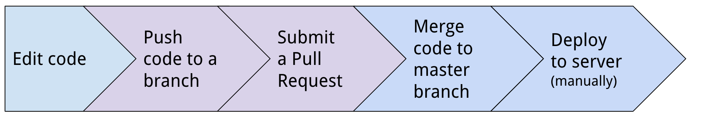
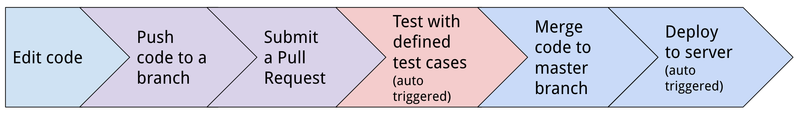
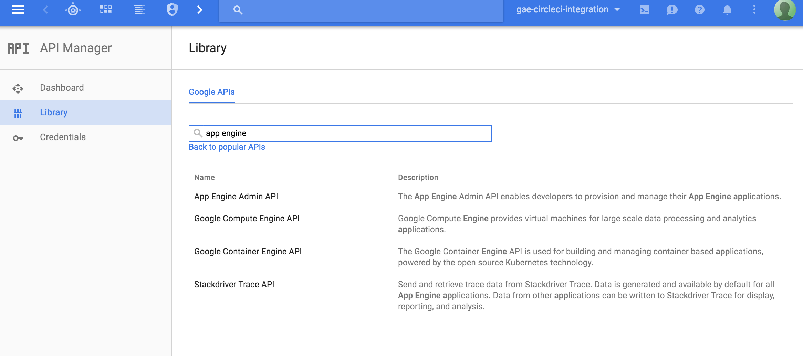
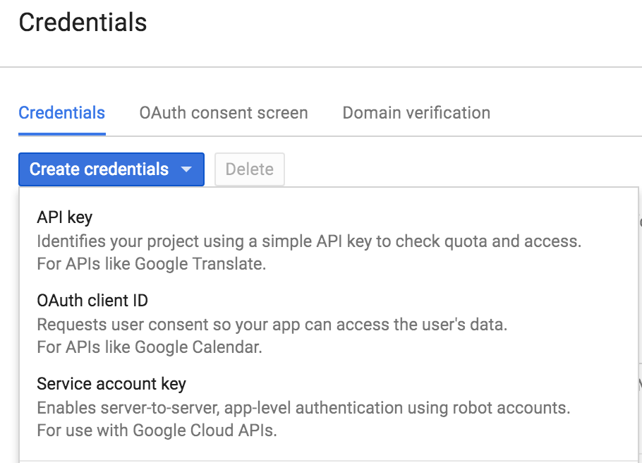
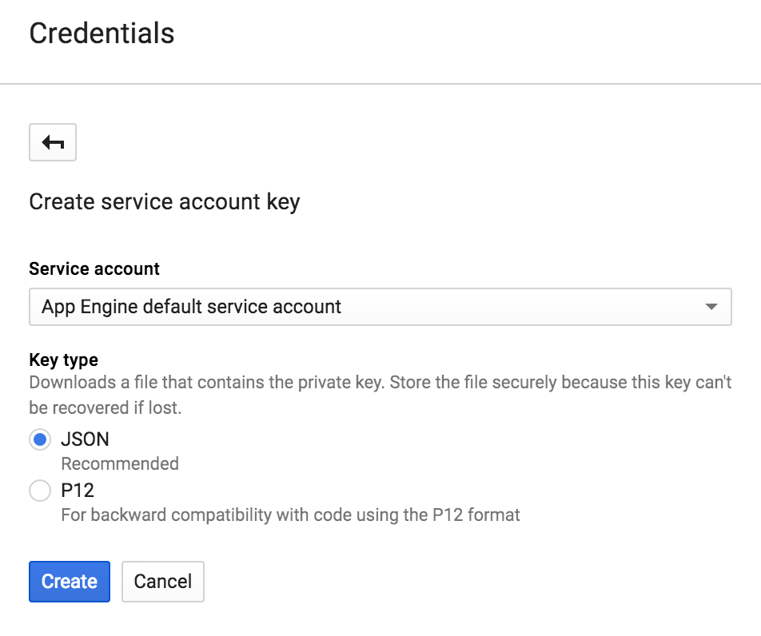
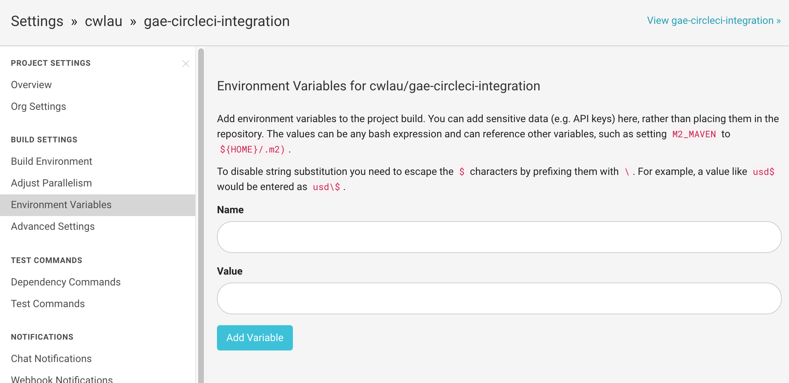
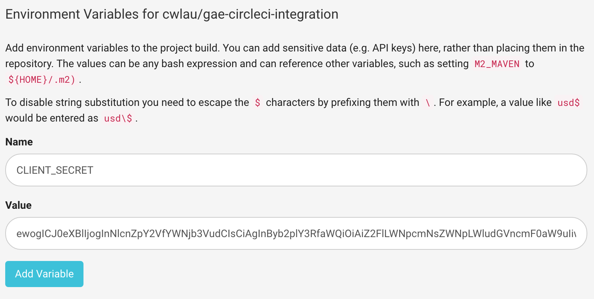

Google App Engine CircleCI Continuous Integration
========================

This repository contains Google App Engine source code which is available for continuous integration with CircleCI.

Live demo: http://gae-circleci-integration.appspot.com

## Overview: Some key steps of the flow

You will go through the following key steps in a normal software development lifecycle:

Without CI: manual test and deployment is required

With CI: test and deployment process is automatic

## Let's begin

You will need to setup both Google Cloud Project and CircleCI.

### Google Cloud Platform

- Create a Cloud project using the Google Cloud Console
- Under API Manager -> Google APIs, search and enable the App Engine Admin APIs

- Under Api Manager -> Credentials -> Service Account key, create a JSON key and download it.

### CircleCI

You will need to base64 encode the key files and add to the Circle CI project as an environment variable.

- Go to Circle CI. If you haven't already done so, create an account and enable your project.
- On the top right, click Project Settings, then on the left click Environment Variables.

- Base64 encode the client secret JSON file

`base64 <your_secret.json>`

- Copy the output of the base64 command into the 'Value' form, with the name CLIENT_SECRET, then click Save Variable.

- In the circle.yml file, replace the project_id in `GCLOUD_PROJECT: "gae-circleci-integration"` with your project id.

- In the circle.yml file, replace the project_id in `gcloud config set project gae-circleci-integration` with your project id.
- In run_test.py, replace the in the HOST variable with the URL your project will be deployed to https://gae-circleci-integration.appspot.com.

- Commit and push your changes. The circle project should run the local tests, then use the gcloud SDK (authenticated with the client-secret) to deploy to the appspot URL, then run the e2e tests against that URL.

### Reference

[Google Cloud Platform Github demo for App Engine integration](https://github.com/GoogleCloudPlatform/continuous-deployment-circle)
